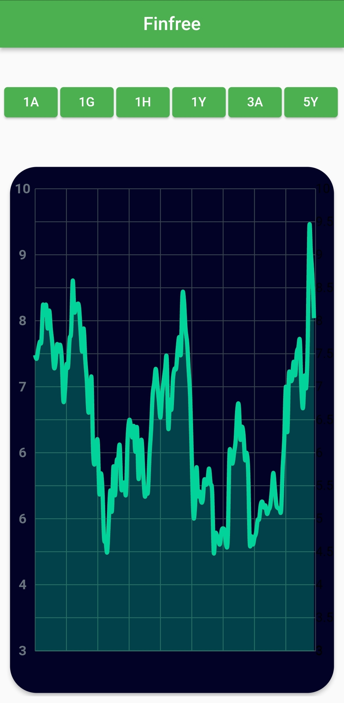
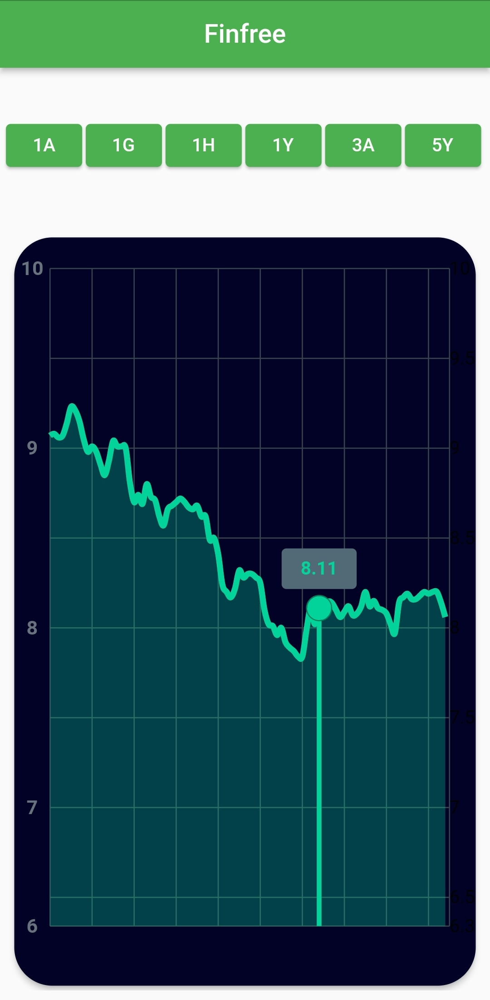

# Finfree

It has been created for Finfree assignment.

## Getting Started

Project gets datas from API as 1Day, 1Week, 1Month, 1Year and 5Year

- First, It has been created APIBase as an abstract class to clarify common attitude.
- Later, It has been created API service that check datas from endpoint.
- Last, It has been implemented [fl_chart](https://github.com/imaNNeoFighT/fl_chart) to visualize, [get_it](https://pub.dev/packages/get_it) to seperate layer and communicate, [provider](https://pub.dev/packages/provider) to manage statement.




## Installation
```bash
git clone https://github.com/hkaya15/Finfree.git
```
## License 
[MIT](https://choosealicense.com/licenses/mit/)
